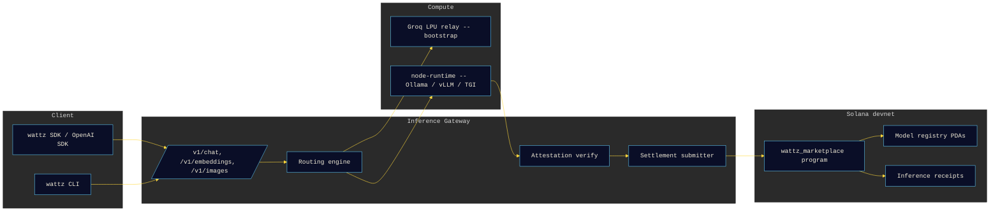

# Wattz

**CA: fxcX1xSZ4Uz9pimw97XENdEHwexHrfaRkEkKeHupump**


The first OpenAI-wire-compatible inference marketplace on Solana. An
OpenAI-compatible gateway, attestation-verified compute, an on-chain model
registry with license tracking, Token-2022 streaming settlement, and
self-operated bootstrap GPU nodes.

Power the inference.

[](https://wattz.fi)
[](https://wattz.fi/docs)
[](https://x.com/wattzfi)
[](https://github.com/wattz-compute/wattz/actions/workflows/ci.yml)
[](LICENSE)
[](https://github.com/wattz-compute/wattz/stargazers)
[](https://www.rust-lang.org)
[](https://www.typescriptlang.org)
[](https://explorer.solana.com/address/GUDVbE4Jgmtu8jgxUVtq2wUmjdLxJzPqT3zET2EdTLiU?cluster=devnet)
[](https://www.anchor-lang.com)
[](https://www.npmjs.com/package/@wattz/sdk)
[](https://www.npmjs.com/package/wattz-cli)

## Status

Stated plainly, because devnet is the truth today.

| Component | Status |
|-----------|--------|
| Program | Solana **devnet** -- [`GUDVbE4Jgmtu8jgxUVtq2wUmjdLxJzPqT3zET2EdTLiU`](https://explorer.solana.com/address/GUDVbE4Jgmtu8jgxUVtq2wUmjdLxJzPqT3zET2EdTLiU?cluster=devnet) |
| Gateway | live at [`https://api.wattz.fi`](https://api.wattz.fi/healthz) (`GET /healthz`) |
| GPU nodes | 0 external nodes registered -- registration is open |
| Playground | Inference is relayed through Groq LPU capacity until the first bare-metal node registers. The wire protocol does not change. |
| `/v1/models` | populates as nodes register (empty on the relay-only bootstrap path) |

## What

Wattz exposes a familiar `POST /v1/chat/completions` HTTP surface, then does
three things behind it:

1. Picks the best available compute for the request (price / region / model /
   reputation / attestation profile). Until external GPU nodes register,
   requests take the Groq LPU relay path.
2. Forwards the request, streams the response back to the client, and -- on the
   node path -- collects a compute attestation envelope (Intel SGX DCAP, AMD
   SEV-SNP, or NVIDIA Confidential Computing) plus, optionally, a Risc0 or SP1
   receipt. On the relay path the attestation reports `kind: relay`,
   `verified: false`.
3. Signs an `InferenceReceipt` and submits it to the on-chain marketplace
   program on Solana devnet. `settle_inference` runs after a dispute window and
   splits the price 80 % node immediate / 10 % node pending / 5 % model
   publisher / 5 % project fee; half of the project fee -- 2.5 % of every
   settled fee -- is burned by a direct SPL Token burn CPI.

Some models in the registry are gated on caller KYC when their license
requires it (Llama above the Meta MAU threshold, for example). The gateway
enforces this by checking the model's KYC flag before it forwards.

## Architecture



More detail, including a request sequence diagram, in
[`docs/architecture.md`](docs/architecture.md).

## Repository Layout

```
packages/
├── inference-gateway/     Rust axum. OpenAI-compatible surface + routing + attestation + settlement.
├── node-runtime/          Rust GPU-node host. Wraps Ollama / vLLM / TGI. Emits attestation envelopes.
├── compute-verifier/      Rust. SGX DCAP, SEV-SNP, NVIDIA CC + Risc0 / SP1 receipt verifier.
├── anchor-program/        Anchor 0.31 wattz_marketplace program (nodes / models / receipts / disputes).
├── model-registry/        TypeScript model + license catalogue used by the gateway and the CLI.
├── routing-engine/        TypeScript node scoring library.
├── streaming-payment/     Token-2022 transfer-hook streamer with SSE bridge.
├── bootstrap-nodes/       Docker + Runpod / Vast.ai / Lambda / local deploy scripts.
├── sdk-ts/                @wattz/sdk. OpenAI-SDK-compatible TypeScript client.
└── cli/                   wattz-cli npm package (node / model / infer / stake commands).

apps/
├── web/                   Next.js landing + Inference Playground. Three.js substation scene.
└── operator/              Node operator dashboard (revenue / uptime / GPU / attestation status).

docs/
├── architecture.md
├── inference-spec.md
├── tee-attestation.md
├── benchmarks.md
└── security.md
```

## OpenAI-Compatible API

The gateway speaks the OpenAI Chat / Embeddings / Images subset. Anything that
talks to `api.openai.com` should work by swapping the base URL:

```bash
curl https://api.wattz.fi/v1/chat/completions \
  -H "Content-Type: application/json" \
  -d '{
    "model": "llama-3.1-8b-instant",
    "messages": [{"role": "user", "content": "Hello"}],
    "stream": true
  }'
```

TypeScript example using the official `openai` SDK:

```ts
import OpenAI from "openai";

const client = new OpenAI({
  baseURL: "https://api.wattz.fi/v1",
  apiKey: process.env.WATTZ_KEY ?? "",
});

const stream = await client.chat.completions.create({
  model: "llama-3.1-8b-instant",
  messages: [{ role: "user", content: "Summarise Solana Token-2022." }],
  stream: true,
});

for await (const chunk of stream) {
  process.stdout.write(chunk.choices[0]?.delta?.content ?? "");
}
```

Full request/response surface, extra `wattz_*` fields, and the `x-wattz-*`
response headers are documented in [`docs/inference-spec.md`](docs/inference-spec.md).

## Local Development

Prerequisites: Rust (stable), Node 20+, pnpm 9+, Anchor 0.31, Solana CLI 2.x,
and either a local GPU with Ollama or a Runpod / Vast.ai / Lambda GPU rental
(see `packages/bootstrap-nodes/`).

```bash
pnpm install

# Rust crates that CI verifies
cargo check -p wattz-compute-verifier -p wattz-node-runtime

# Anchor program (devnet)
cd packages/anchor-program && anchor build && cd -

# Inference gateway (defaults to :8080)
cargo run --package wattz-inference-gateway

# Web app (defaults to :3000) -- apps are standalone, install locally
cd apps/web && pnpm install && pnpm dev
```

Copy `.env.example` to `.env` and fill it in. The gateway needs a Solana RPC
URL and either a node in `WATTZ_STATIC_NODES` or the Groq relay credentials.

## Verification

On the node path, each inference receipt carries an attestation envelope.
`packages/compute-verifier` parses and checks:

- **Intel SGX DCAP** quotes over NIST P-256 ECDSA.
- **AMD SEV-SNP** attestation reports over NIST P-384 ECDSA.
- **NVIDIA Confidential Computing** attestation blobs.
- **Risc0** and **SP1** receipts by checking the outer EdDSA commitment over
  the zkVM output digest.

Signatures are verified against a per-node key pinned at registration; full
PCS / NRAS collateral-chain verification is on the roadmap. On the current
relay path, attestation reports `kind: relay`, `verified: false`. Details in
[`docs/tee-attestation.md`](docs/tee-attestation.md).

## Benchmarks

Reproducible latency numbers (measured, not projected) live in
[`docs/benchmarks.md`](docs/benchmarks.md) and are produced by
`scripts/bench.sh`. On the bootstrap relay path, TTFB p50 is ~414 ms
(measured 2026-07-02, 20 requests to `api.wattz.fi`).

## Deployment Targets

- Vercel: `apps/web` and `apps/operator`.
- Railway: `packages/inference-gateway` (Docker image from `Dockerfile.gateway`).
- Solana: `packages/anchor-program` (devnet).
- npm: [`@wattz/sdk`](https://www.npmjs.com/package/@wattz/sdk) (`packages/sdk-ts`), [`wattz-cli`](https://www.npmjs.com/package/wattz-cli) (`packages/cli`).
- GPU: Docker Compose bundle in `packages/bootstrap-nodes/docker/` for local
  rigs; deploy scripts for Runpod, Vast.ai, and Lambda in the same folder.

## Contributing

Issues and PRs welcome. The verification scripts under `scripts/` are what CI
runs against every PR (no placeholders, no leaked secrets, no marketing tone,
no mainnet claims). Keep the copy in the web app minimal -- no exclamation
marks in headings, no adjective stacks. See
[`docs/security.md`](docs/security.md) for the disclosure policy.

## License

Apache-2.0. See [LICENSE](LICENSE).

Model licenses are separate. The `model-registry` package tracks the upstream
license per entry (Llama 3.1 / 3.3 = Meta Community, GPT-OSS = Apache-2.0,
Stable Diffusion XL = CreativeML Open RAIL-M, Whisper = MIT) and the Anchor
program refuses to settle receipts for gated models unless the caller has
cleared KYC.
