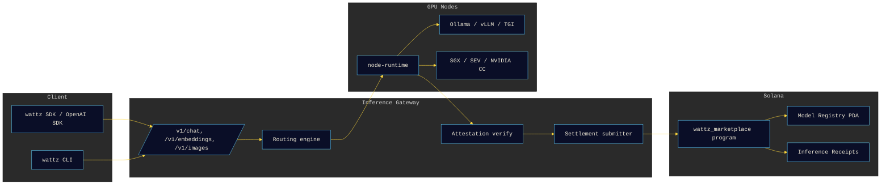

# Wattz


Solana AI inference marketplace. OpenAI-compatible gateway, TEE-verified
compute, on-chain model registry with licence tracking, Token-2022
streaming micro payments, and self-operated bootstrap GPU nodes.

Power the inference.

[](https://wattz.fi)
[](https://wattz.fi/docs)
[](https://x.com/wattzfi)
[](LICENSE)
[](https://www.rust-lang.org)
[](https://www.typescriptlang.org)
[](https://www.anchor-lang.com)
[](https://explorer.solana.com/address/GUDVbE4Jgmtu8jgxUVtq2wUmjdLxJzPqT3zET2EdTLiU?cluster=devnet)
[](https://platform.openai.com/docs/api-reference)

## What

Wattz exposes a familiar `POST /v1/chat/completions` HTTP surface, then does
three things behind it:

1. Picks the best of the registered GPU nodes for the request (price / region
   / model / reputation / TEE profile).
2. Forwards the request, streams the response back to the client, and
   collects a compute attestation from the node (Intel SGX DCAP, AMD SEV-SNP,
   or NVIDIA Confidential Computing) plus, optionally, a Risc0 or SP1
   receipt.
3. Signs an `InferenceReceipt` and submits it to the on-chain marketplace
   program on Solana, which settles after a dispute window and burns half
   of the protocol fee.

The Anchor program is deployed on Solana devnet at
[`GUDVbE4Jgmtu8jgxUVtq2wUmjdLxJzPqT3zET2EdTLiU`](https://explorer.solana.com/address/GUDVbE4Jgmtu8jgxUVtq2wUmjdLxJzPqT3zET2EdTLiU?cluster=devnet).
Mainnet deployment is planned; the IDL and PDA layout are already stable.

Some models in the registry are gated on caller KYC when their licence
requires it (Llama 3 above the Meta MAU threshold, for example). The
gateway enforces this by checking `Model.kyc_gated` before it forwards.

## Architecture



## Repository Layout

```
packages/
├── inference-gateway/     Rust axum. OpenAI-compatible surface + routing + attestation + settlement.
├── node-runtime/          Rust GPU-node host. Wraps Ollama / vLLM / TGI. Emits TEE + Risc0 / SP1 quotes.
├── compute-verifier/      Rust. SGX DCAP, SEV-SNP, NVIDIA CC + Risc0 / SP1 receipt verifier.
├── anchor-program/        Anchor 0.31 wattz_marketplace program (nodes / models / receipts / disputes).
├── model-registry/        TypeScript model + licence catalogue used by the gateway and the CLI.
├── routing-engine/        TypeScript node scoring library.
├── streaming-payment/     Token-2022 transfer-hook streamer with SSE bridge.
├── bootstrap-nodes/       Docker + Runpod / Vast.ai / Lambda / local deploy scripts.
├── sdk-ts/                @wattz/sdk. OpenAI-SDK-compatible TypeScript client.
└── cli/                   wattz-cli npm package (node / model / infer / stake commands).

apps/
├── web/                   Next.js 14 landing + Inference Playground. Three.js substation scene.
└── operator/              Node operator dashboard (revenue / uptime / GPU / attestation status).

docs/
├── architecture.md
├── inference-spec.md
├── tee-attestation.md
└── security.md
```

## OpenAI-Compatible API

The gateway speaks the OpenAI Chat / Embeddings / Images subset. Anything
that talks to `api.openai.com` should work by swapping the base URL:

```bash
curl https://api.wattz.fi/v1/chat/completions \
  -H "Content-Type: application/json" \
  -H "Authorization: Bearer $WATTZ_KEY" \
  -d '{
    "model": "llama-3-8b-instruct",
    "messages": [{"role": "user", "content": "Hello"}],
    "stream": true
  }'
```

TypeScript example using the official `openai` SDK:

```ts
import OpenAI from "openai";

const client = new OpenAI({
  baseURL: "https://api.wattz.fi/v1",
  apiKey: process.env.WATTZ_KEY,
});

const stream = await client.chat.completions.create({
  model: "mistral-7b-instruct",
  messages: [{ role: "user", content: "Summarise Solana Token-2022." }],
  stream: true,
});

for await (const chunk of stream) {
  process.stdout.write(chunk.choices[0]?.delta?.content ?? "");
}
```

## Local Development

Prerequisites: Rust 1.85+, Node 20+, pnpm 9+, Anchor 0.31, Solana CLI 2.x,
either a local GPU with Ollama or a Runpod / Vast.ai / Lambda GPU rental
(see `packages/bootstrap-nodes/`).

```bash
pnpm install
cargo check --workspace

# Anchor program
cd packages/anchor-program && anchor build && cd -

# Inference gateway (defaults to :8080)
cargo run --package wattz-inference-gateway

# Web (defaults to :3000)
pnpm --filter @wattz/web dev
```

The gateway needs at least one node URL in `NODE_POOL` and a Solana RPC
URL. Copy `.env.example` to `.env` and fill it in.

## Verification

Each inference receipt carries a TEE attestation hash. `packages/compute-verifier`
verifies:

- **Intel SGX DCAP** quotes over NIST P-256 ECDSA against the Intel Attestation Service PCS.
- **AMD SEV-SNP** attestation reports (VCEK + ARK / ASK chain) over NIST P-384 ECDSA.
- **NVIDIA Confidential Computing** attestation over the CC certificate.
- **Risc0** and **SP1** receipts by checking the outer ed25519 commitment
  over the zkVM output digest.

Details in `docs/tee-attestation.md`.

## Deployment Targets

- Vercel: `apps/web` (`wattz-web`) and `apps/operator` (`wattz-operator`).
- Railway: `packages/inference-gateway` (Docker image built from `Dockerfile.gateway`).
- Solana: `packages/anchor-program` (devnet today, mainnet next).
- npm: `packages/sdk-ts` (`@wattz/sdk`), `packages/cli` (`wattz-cli`).
- GPU: Docker Compose bundle in `packages/bootstrap-nodes/docker/` for local RTX
  rigs; deploy scripts for Runpod, Vast.ai and Lambda in the same folder.

## Contributing

Issues and PRs welcome. The verification scripts under `scripts/` are what
CI runs against every PR (no placeholders, no leaked secrets, no marketing
tone). Please keep the copy in the web app minimal -- no exclamation marks
in headings, no adjective stacks. See `docs/security.md` for the disclosure
policy.

## Licence

Apache-2.0. See [LICENSE](LICENSE).

Model licences are separate. The `model-registry` package tracks the
upstream licence per entry (Llama 3 = Meta Community, Mistral = Apache-2.0,
Stable Diffusion = CreativeML Open RAIL-M, Whisper = MIT) and the
Anchor program refuses to settle receipts for gated models unless the
caller has cleared KYC.
