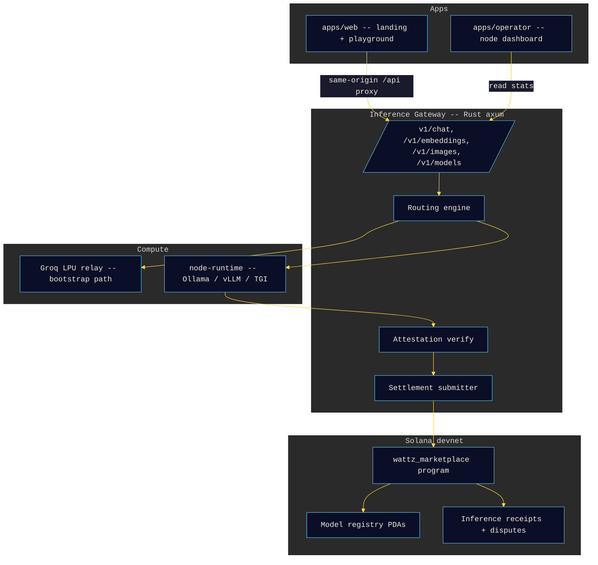
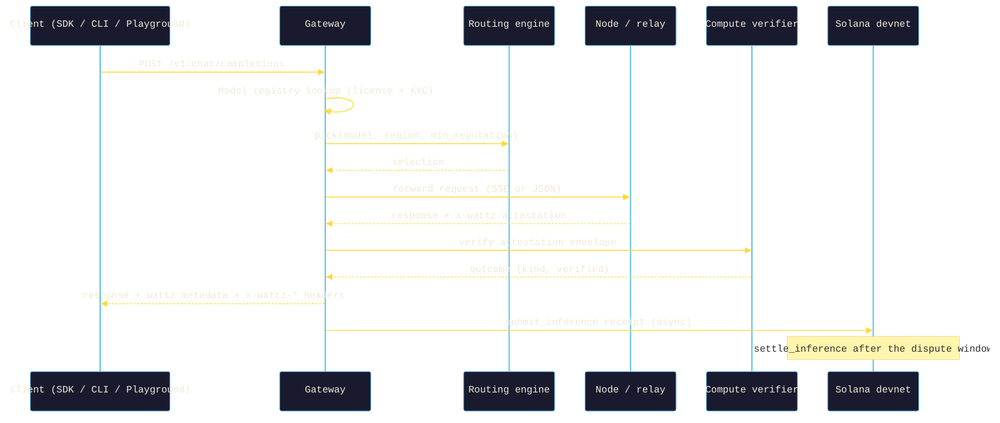

# Wattz Architecture

OpenAI-wire-compatible inference marketplace on Solana. OpenAI-compatible
gateway, attestation verification, an on-chain model registry, Token-2022
streaming settlement, and self-operated bootstrap nodes.

The marketplace program is deployed on Solana devnet at
[`GUDVbE4Jgmtu8jgxUVtq2wUmjdLxJzPqT3zET2EdTLiU`](https://explorer.solana.com/address/GUDVbE4Jgmtu8jgxUVtq2wUmjdLxJzPqT3zET2EdTLiU?cluster=devnet).
Inference is relayed through Groq LPU capacity until the first bare-metal node
registers. The wire protocol does not change.

## High-Level Topology

The browser only ever talks to the Next.js Route Handlers (same origin) and a
public Solana RPC through the wallet adapter. Keyed RPC and any settlement key
stay server-side.

## Package Responsibilities

| Package | Role |
|---------|------|
| `packages/inference-gateway` | OpenAI-compatible API. Routes to the right compute path. Verifies node attestation. Emits inference receipts. |
| `packages/anchor-program` | Anchor 0.31 program on Solana devnet. Nodes, models, receipts, disputes, staking, slashing. |
| `packages/model-registry` | Model metadata + license enforcement + KYC gating helpers. |
| `packages/compute-verifier` | Intel SGX / AMD SEV-SNP / NVIDIA CC quote parsing + Risc0 / SP1 receipt verification against pinned per-node keys. |
| `packages/routing-engine` | Node selection scoring: model support, region, price, latency, reputation. |
| `packages/streaming-payment` | Token-2022 transfer hook driving per-token micro payments alongside SSE streams. |
| `packages/node-runtime` | Rust GPU node host. Wraps Ollama / vLLM / TGI. Signs and emits attestation envelopes. |
| `packages/bootstrap-nodes` | Docker Compose + Runpod / Vast.ai / Lambda / local RTX deployment scripts for project-owned nodes. |
| `packages/sdk-ts` | TypeScript SDK. Matches the OpenAI SDK surface. |
| `packages/cli` | `wattz-cli` npm package. Node operator + model publisher CLI. |
| `apps/web` | Landing + Playground. |
| `apps/operator` | Node operator dashboard. |

## Data Flow: A Chat Completion

1. Client (SDK, CLI, or web Playground) POSTs `/v1/chat/completions` to the
   gateway.
2. The gateway resolves the `model` against the model registry (license +
   KYC), rejecting unknown or gated models.
3. The routing engine picks a compute path. Until external GPU nodes
   register, requests take the Groq LPU relay path; the attestation on that
   path reports `kind: relay`, `verified: false`.
4. The gateway forwards the request. Streaming responses are relayed as SSE
   chunks; non-streaming responses are relayed as JSON with a `wattz`
   metadata block appended.
5. When a node (rather than the relay) serves the request, the gateway
   verifies the returned attestation envelope with `compute-verifier` before
   trusting the receipt.
6. The gateway packs an `InferenceReceipt` and calls `submit_inference` on the
   devnet program with prompt/response/attestation hashes, token counts, and
   price.
7. `settle_inference` runs after the dispute window (`DISPUTE_WINDOW_SECS`,
   default 3600 s). The price splits 80 % node immediate / 10 % node pending /
   5 % model publisher / 5 % project fee; half of the project fee (2.5 % of the
   settled price) is burned by a direct SPL Token burn CPI, the rest goes to
   the treasury.
8. Token-2022 streaming settlement activates with the `$WATTZ` mint at launch,
   walking the transfer hook so payment matches the work actually delivered.

## Failure Modes

- Node returns an unverifiable attestation -> verify fails -> the gateway
  retries on a different path and the offending node's reputation drops.
  Repeated failures (or a dispute) can trigger `slash_node`.
- Node goes silent mid-stream -> the gateway falls back to the bootstrap /
  relay path for the remaining tokens.
- Model license blocks the caller (for example a Meta Community License caller
  claimed above the MAU threshold) -> the gateway returns
  `license_violation` and never bills.
- Gateway loses its Solana RPC -> receipts pool locally and flush once RPC
  returns. Nothing is dropped.

## Security Boundaries

- Client-side code never touches a keyed RPC. `NEXT_PUBLIC_SOLANA_RPC` is a
  public endpoint and is the only RPC the browser sees.
- Keyed RPC URLs live server-side only, behind the gateway and the Next.js
  Route Handlers.
- The gateway holds `ANCHOR_KEYPAIR` for settlement signing. It never leaves
  the gateway host.
- Node operators sign attestation envelopes with a per-node key pinned at
  registration. The compute-verifier crate rejects envelopes whose signature
  does not match the pinned key.
