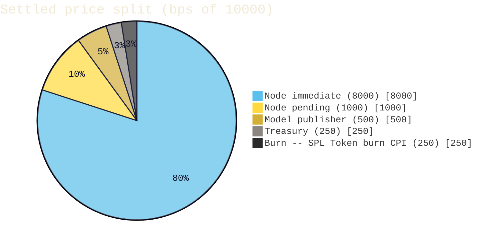

# @wattz/anchor-program

Anchor 0.31 program powering the Wattz inference marketplace on Solana.

- Program id: [`GUDVbE4Jgmtu8jgxUVtq2wUmjdLxJzPqT3zET2EdTLiU`](https://explorer.solana.com/address/GUDVbE4Jgmtu8jgxUVtq2wUmjdLxJzPqT3zET2EdTLiU?cluster=devnet) (regenerate with `anchor keys sync` when deploying under a new keypair)
- Settlement token: `$WATTZ` (SPL Token, 9 decimals; mint activates at launch)
- Target cluster: `devnet`
- Tooling: Solana platform-tools >= v1.48 (rustc 1.84+), Anchor CLI 0.31.1, Node 20+

## Layout

```
packages/anchor-program/
  Anchor.toml
  Cargo.toml
  package.json
  tsconfig.json
  programs/wattz-marketplace/
    Cargo.toml
    Xargo.toml
    src/
      lib.rs                    -- #[program] entrypoint
      constants.rs              -- economic + PDA-seed constants
      errors.rs                 -- #[error_code] enum
      events.rs                 -- #[event] emitters
      state/
        config.rs               -- Config singleton PDA
        node.rs                 -- NodeAccount PDA
        model.rs                -- ModelAccount + License enum
        inference.rs            -- InferenceReceipt PDA
        dispute.rs              -- DisputeAccount + Resolution enum
        stake.rs                -- StakeAccount PDA
      instructions/
        initialize.rs
        register_node.rs
        register_model.rs
        submit_inference.rs
        settle_inference.rs
        open_dispute.rs
        resolve_dispute.rs
        slash_node.rs
        stake.rs                -- increase_stake
        unstake.rs
        claim_reward.rs
  tests/wattz-marketplace.ts    -- mocha end-to-end
  migrations/deploy.ts
  scripts/copy-idl.sh
  idl/                          -- IDL destination for downstream packages
```

## Instructions

| # | Instruction | Signer(s) | Notes |
|---|---|---|---|
| 1 | `initialize` | admin | Creates `Config` PDA + vault ATA. `min_node_stake` and `dispute_window_secs` are configurable. |
| 2 | `register_node` | node authority | Locks `initial_stake` (>= `config.min_node_stake`) into the vault, seeds `NodeAccount` and `StakeAccount`. |
| 3 | `register_model` | model publisher | Registers name/version/license/IPFS/price. Meta Community + Custom licenses auto-enable KYC gating. |
| 4 | `submit_inference` | gateway (== `config.gateway`) | Records receipt PDA + funds the vault with `price` from the gateway's token account. |
| 5 | `settle_inference` | any | After the dispute window, distributes 80/10/5 (node immediate / node pending / publisher), 2.5% treasury, 2.5% burn via SPL Token burn CPI. |
| 6 | `open_dispute` | any | Opens a dispute against a non-settled receipt during the window. |
| 7 | `resolve_dispute` | admin | Records outcome (FavorOpener / FavorNode / Split) and applies the reputation delta. |
| 8 | `slash_node` | admin | Burns a portion of the stake once reputation <= slashing threshold. |
| 9 | `increase_stake` | staker | Deposits additional stake + extends lock. |
| 10 | `unstake` | staker | Withdraws stake after lock expiry. |
| 11 | `claim_reward` | node authority | Withdraws accumulated `pending_rewards` (uptime pool). |

## PDA seeds

All PDAs are derived from `program_id` and the seeds below (see
`constants.rs`).

| Account | Seeds | Notes |
|---------|-------|-------|
| `Config` | `["config"]` | Singleton. Holds mint, treasury, gateway, dispute window. |
| `NodeAccount` | `["node", authority]` | One per node operator authority. |
| `ModelAccount` | `["model", <model key>]` | One per registered model. |
| `InferenceReceipt` | `["receipt", request_id]` | One per settled request; idempotent by request id. |
| `DisputeAccount` | `["dispute", receipt]` | Opened against a receipt during its window. |
| `StakeAccount` | `["stake", authority]` | Per-operator stake bookkeeping. |
| Vault authority | `["vault_authority"]` | PDA signer that owns the vault ATA. |

## Economics

The settled price is split in basis points of `BPS_DENOMINATOR` (10_000).
The shares sum to 100% and are enforced at compile time in `constants.rs`.



The project fee is 5% (`PROJECT_FEE_BPS = 500`). Of that, `BURN_RATE_BPS =
5000` (half) is burned via a direct `spl_token::burn` CPI -- 2.5% of every
settled fee -- and the remainder goes to the treasury.

## Key constants (`constants.rs`)

| Constant | Value | Meaning |
|----------|-------|---------|
| `MIN_NODE_STAKE` | 100_000_000_000 | 100 $WATTZ (9 decimals) minimum node stake. |
| `DISPUTE_WINDOW_SECS` | 3_600 | Default 1-hour window before a receipt can settle. |
| `DEFAULT_STAKE_LOCK_SECS` | 604_800 | 7-day stake lock at register / top-up. |
| `MAX_REPUTATION` | 10_000 | Upper bound on node reputation. |
| `MIN_REPUTATION_BEFORE_SLASH` | -100 | Reputation at/below which a node may be slashed. |
| `NODE_IMMEDIATE_BPS` / `NODE_PENDING_BPS` | 8000 / 1000 | Node immediate + pending shares. |
| `PUBLISHER_SHARE_BPS` / `PROJECT_FEE_BPS` | 500 / 500 | Publisher + project-fee shares. |
| `BURN_RATE_BPS` | 5000 | Half of the project fee is burned (2.5% of price). |

## Build & test

```bash
# One-shot build (also emits IDL + TS types)
anchor build

# Sync program keypair -> declare_id! / Anchor.toml
anchor keys sync

# Copy IDL/types to package-local dirs for downstream SDKs
bash scripts/copy-idl.sh

# End-to-end mocha (spins up an ephemeral validator)
anchor test
```

Note: Solana platform-tools older than v1.48 ship rustc 1.75, which cannot
compile some transitive dependencies. Install a compatible version with
`agave-install init 2.3.0` (platform-tools v1.48, rustc 1.84) or newer.

## Deploy to devnet

```bash
# 1. Fund ~/.config/solana/id.json with devnet SOL.
solana airdrop 2 --url devnet
solana balance --url devnet

# 2. Build + deploy.
anchor build
anchor deploy --provider.cluster devnet

# 3. Publish the IDL on-chain (optional but recommended).
anchor idl init \
  --filepath target/idl/wattz_marketplace.json \
  --provider.cluster devnet \
  $(solana address -k target/deploy/wattz_marketplace-keypair.json)

# 4. Fold the program id into the web env:
#    NEXT_PUBLIC_2_PROGRAM_ID=<program id>
```

Verify the deployment on the
[devnet explorer](https://explorer.solana.com/address/GUDVbE4Jgmtu8jgxUVtq2wUmjdLxJzPqT3zET2EdTLiU?cluster=devnet).

## Related

- Gateway (Rust axum): `packages/inference-gateway/`
- Node runtime (Rust): `packages/node-runtime/`
- SDK (TypeScript): `packages/sdk-ts/`
- Streaming payment (Token-2022): `packages/streaming-payment/`
- Web (Next.js): `apps/web/`
